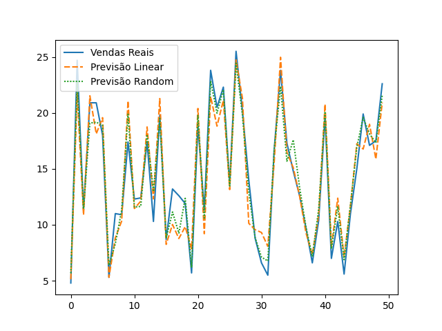
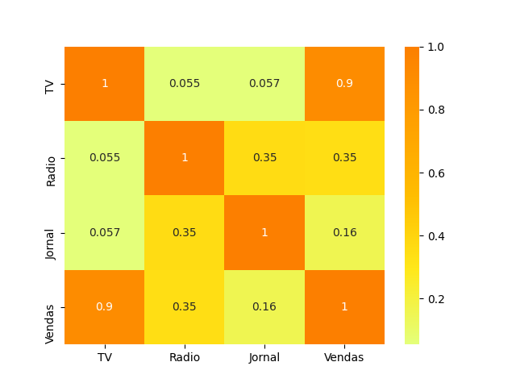

# **IA** - Relação Propaganda/Faturamento
_______________________________________________
##### Essa IA é capaz de verificar os investimentos em propaganda de uma empresa X em três meios de comunicação: TV, rádio e jornal e identificar a relação direta desses investimentos com o faturamento.
##### Foram analisados 75% dos dados e os 25% dos dados restantes foi dado sem a coluna de faturamento para a IA treinada adivinhar seus valores
##### Utilizado Programação Estrutural como paradigma.
_______________________________________________
_______________________________________________

## Dois métodos de aprendizagem da IA e Erro Quadrático Médio para verificar o quanto os métodos erram ao tentar prever os resultados

### 1. Regressão Linear
#### Acertou aproximadamente 89% da previsão de faturamento (0.8860)
#### Erro Quadrático Médio de 2.6900 (Quanto mais baixo o valor menos a previsão errou)

### 2. *Random Forest*
#### Acertou aproximadamente 93% da previsão de faturamento (0.9302)
#### Erro Quadrático Médio de 1.6463 (Quanto mais baixo o valor menos a previsão errou)

_______________________________________________
_______________________________________________
#### Bibliotecas utilizadas no projeto:
* Pandas
* Seaborn
* Matplotlib
* SKlearn
_______________________________________________
_______________________________________________

## Conclusão

#### Foi verificado que pra esse caso em específico de regressão e aprendizado de máquina a utilização de *Random Forest* é mais eficaz que a Regressão Linear simples
1. Gráfico mostrando o comparativo de vendas reais e as duas previsões utilizadas

#### Também foi verificado uma relação íntima entre investimento em propagandas na TV e faturamento
2. Gráfico com o *mapa de calor* entre o faturamento e os investimentos em propagandas nos três meios de comunicação*

######*Quanto mais alaranjado e mais próximo de 1 for a célula, mais próxima a relação entre os dados